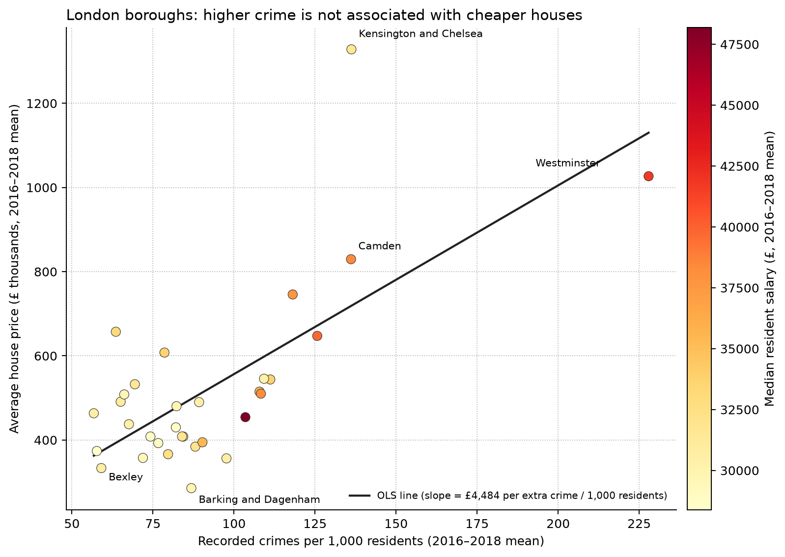

# CISC7204 Project Proposal

**Course:** CISC7204  
**Working directory:** `CISC7204_London_Housing_Crime`

---

## Project Title

**Crime and House Prices in London Boroughs**

**Research question:** In London, United Kingdom, do administrative areas with more crime records have lower average house prices?

This is a judgement based on common sense (crime is commonly believed to depress house prices). This proposal aims to test whether public data at the administrative-area level actually support that claim.

---

## Region and Domain

- **Region:** London, United Kingdom (covering 32 London boroughs; the City of London is excluded from the 2016–2018 panel because crime or population data are incomplete)
- **Domain category:** Housing and urban safety (house prices, crime records, residents’ income)

---

## Datasets (at least two public links)

1. **Housing in London (Kaggle)** — two CSV files available for download (monthly house prices, sales volume, and crime records; annual wages, population, and dwelling counts):  
   [https://www.kaggle.com/datasets/justinas/housing-in-london](https://www.kaggle.com/datasets/justinas/housing-in-london)

2. **Average house prices by borough (London Datastore / GLA, based on HM Land Registry Price Paid Data)** — official borough-level house-price tables:  
   [https://data.london.gov.uk/dataset/average-house-prices](https://data.london.gov.uk/dataset/average-house-prices)

The Kaggle data package also cites crime summaries recorded by the Metropolitan Police, hosted on the London Datastore:  
[https://data.london.gov.uk/dataset/mps-recorded-crime-geographic-breakdown-exy3m/](https://data.london.gov.uk/dataset/mps-recorded-crime-geographic-breakdown-exy3m/)

Local copies used in this proposal:

- `data/housing_in_london_monthly.csv`
- `data/housing_in_london_yearly.csv`

---

## Visualization and commentary

The figure shows the scatter of 32 London boroughs. The horizontal axis is crime records per 1,000 residents; the vertical axis is average house price. Both are 2016–2018 means, to avoid interference from single-year noise. Point colour represents median resident wages from the annual data. A least-squares line is drawn only as a visual aid.

This figure is intended to answer the research question above, not to predict house prices. If the conventional view held, high-price boroughs would lie in the upper-left of the figure (low crime, high prices), or the relationship would at least slope downward. That is not the case. Spearman’s rank correlation between the crime rate and house prices is **ρ = 0.47 (p ≈ 0.007)**: administrative areas with more crime records per resident tend instead to have higher prices. Westminster and Kensington and Chelsea have high house prices and similarly high crime records per resident; outer boroughs such as Bexley have lower prices and fewer crime records per resident. Wages rise together with both house prices and crime rates, so this pattern is closer to “central, higher-income areas have both higher house prices and more recorded offences” than to “crime causes house prices to fall.” It should be noted that the figure does not show that crime causes high prices; it only shows that these data contain no simple negative association of the form “higher crime, lower prices.”

---

## Project Purpose

### Outcomes

This project combines the course content on statistical inquiry with a real public-data question: take a view that people already hold, find two government-derived tables related to a specified place, process and present the data, and assess whether the results support that view.

### Skills

- **Multi-source joining and aggregation:** Locate and cite public tabular data (CSV / open-data portals); apply groupby + agg to the monthly and annual tables by area and year, then merge them to build a borough-level panel.
- **Panel construction:** Aggregate monthly data to annual (prices as means, crime as sums), and use crime_months >= 10 to exclude years with incomplete crime records.
- **Derived measures:** Construct the population-adjusted crime rate crime_per_1000, to avoid bias from using raw crime counts driven by population size.
- **Association analysis:** Use Spearman rank correlation rather than Pearson, to accommodate non-normal distributions and non-linear but monotonic relationships; also include comparison groups (wages vs house prices, crime counts vs house prices).
- **Visualization design:** Scatter plot + OLS guide line + colour mapping of a third variable + selective labelling of high-leverage points, balancing information density and readability.
- **Matching claims to evidence:** Distinguish association from causation; use the ecological fallacy to explain that borough averages cannot be inferred at the household level.

### Knowledge

- **The distinction between crime “counts” and crime “rates”:** raw crime counts are affected by borough population; this analysis uses crime_per_1000 (crime count ÷ population × 1000) for population adjustment, so that boroughs can be compared.
- **Panel data versus cross-sectional data:** using 2016–2018 three-year means rather than a single year reduces the effect of single-year noise on borough ranking; crime_months >= 10 is also used to exclude years with incomplete crime records.
- **Why Spearman rather than Pearson:** the relationship between house prices and crime rates need not be linear; Spearman requires only a monotonic relationship and is more robust to outliers. This analysis also includes two comparison pairs (wages vs house prices; crime counts vs house prices) to prevent a single correlation from being misread.
- **The effect of high-leverage points on regression:** Westminster has both an extremely high crime rate and extremely high house prices, and it has a marked effect on the OLS slope; this shows that borough-level association results are sensitive to individual points and should be treated separately in robustness checks.
- **Truncation and misleading charts:** axis ranges, the colour-mapped variable, sample size, and the choice of comparison group all affect how strongly readers perceive the relationship; the OLS line on this figure is a visual aid only, not for prediction.
- **Ecological fallacy:** relationships among borough-level averages cannot be inferred at the street or household level; this analysis describes borough-level association only, makes no causal claims, and does not describe any single street or household.

---

## Project Tasks

1. **Establish the research framework:** Select the region (London, United Kingdom) and the domain (housing and urban safety), and pose a statistical question that can be answered yes or no.
2. **Obtain public data:** Download the monthly and annual public tables, retain the original source links, and keep the data traceable.
3. **Build the analysis dataset:** Aggregate monthly data to annual, join annual population and wage information, and form an administrative-area panel.
4. **Filter and clean:** Restrict to years with relatively complete crime records, and take means at the borough level to reduce the effect of single-year fluctuations.
5. **Construct the core measure:** Use the population-adjusted crime rate as the main explanatory variable, to avoid population-size bias from using total crime counts.
6. **Conduct association analysis:** Compute the rank correlation between the crime rate and house prices, and include comparison groups (wages, total crime counts) to aid interpretation.
7. **Complete the visualization:** Draw one scatter plot that presents the relationship between the crime rate and house prices, and label key boroughs.
8. **Write the commentary and planned checks:** Write the figure commentary, stating association rather than causation; if the project continues, a brief robustness check may be added.

**Deliverables:** this proposal, three source CSV files, one research figure, and a Python 3 notebook.

**Guidelines followed:** CISC7204 Project Proposal Ideation; CISC7204 Project Proposal Guideline.

---

## Criteria for Success

A completed proposal / small-scale analysis should:

- Name both the region and the domain in the same research question
- Provide at least two working public-data links, not local files alone
- Include one figure whose axes correspond to the research question
- Report a numerical association next to the figure (here Spearman’s ρ and n)
- State clearly that the result is observational and that no causal inference is made
- Be reproducible with Python 3 notebooks
- **Form of presentation:** This proposal uses a checklist as the success criterion, together with a final visual (`figures/crime_vs_house_price.png`), to help the reader follow the process from data collection and analysis through to interpretation.
- **Success is not high predictive accuracy.** Success means a reader can see whether public data for London’s boroughs support the claim “more crime, cheaper housing,” and can understand why the answer is no.

---

## Collaboration

This proposal is an individual project.
